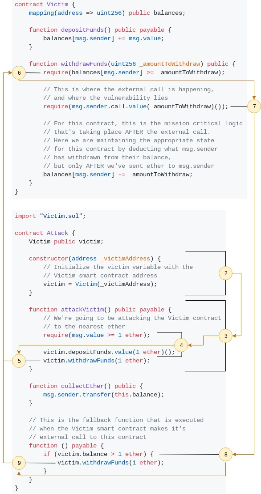
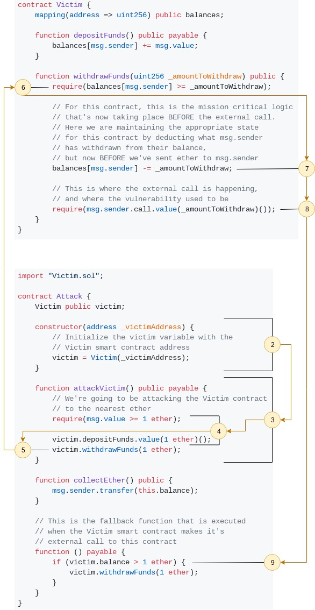

# Reentrancy Attack

## Table of Contents

- [Glossary](#glossary)
- [The Attack](#the-attack)
    - [Victim contract](#victim-contract)
    - [Attacking contract](#attack-contract)
    - [Step by Step](#step-by-step)
        - [Visual Representation](#visual-representation)
- [Preventative Techniques](#preventative-techniques)
    - [Using `transfer`](#using-transfer)
    - [Executing Logic Before Sending Ether](#executing-logic-before-sending-ether)
        - [Revised Victim Contract](#revised-victim-contract)
        - [Same Attacking Contract](#same-attack-contract)
        - [Revised Step by Step](#revised-step-by-step)
            - [Visual Representation - Revised](#visual-representation-revised)
        - [But Wait There's More](#but-wait-theres-more)
- [Real World Example](#real-world-example)
    - [The DAO](#the-dao)

## Glossary

- [Fallback Function](https://solidity.readthedocs.io/en/v0.5.3/contracts.html#fallback-function)
- [Function Selector](https://solidity.readthedocs.io/en/v0.4.21/abi-spec.html#function-selector)
- [Transfer Function](https://solidity.readthedocs.io/en/latest/units-and-global-variables.html#address-related)

## The Attack

Smart contracts, written in _Solidity_ for the _Ethereum Virtual Machine (EVM)_, are able to make external calls to either _Externally Owned Accounts (EOAs)_ or other smart contracts.

When a _reentrancy attack_ occurs, an attacker abuses an external call made by the victim smart contract to execute a _fallback function_ within the attacking smart contract that then performs an additional external call back into the victim smart contract, hence the term _reentrancy_.

This presents a problem when the victim smart contract's external call is executed **before** some mission critical logic takes place to maintain expected state and behavior of the victim smart contract.

For example, the following code represents two smart contracts, one named `Victim` and the other, `Attack`:

### Victim Contract

```solidity
contract Victim {
    mapping(address => uint256) public balances;

    function depositFunds() public payable {
        balances[msg.sender] += msg.value;
    }

    function withdrawFunds(uint256 _amountToWithdraw) public {
        require(balances[msg.sender] >= _amountToWithdraw);

        // This is where the external call is happening,
        // and where the vulnerability lies
        require(msg.sender.call.value(_amountToWithdraw)());

        // For this contract, this is the mission critical logic
        // that's taking place AFTER the external call.
        // Here we are maintaining the appropriate state
        // for this contract by deducting what msg.sender
        // has withdrawn from their balance,
        // but only AFTER we've sent ether to msg.sender
        balances[msg.sender] -= _amountToWithdraw;
    }
}
```

### Attack Contract

```solidity
import "Victim.sol";

contract Attack {
    Victim public victim;

    constructor(address _victimAddress) {
        // Initialize the victim variable with the
        // Victim smart contract address
        victim = Victim(_victimAddress);
    }

    function attackVictim() public payable {
        // We're going to be attacking the Victim contract
        // to the nearest ether
        require(msg.value >= 1 ether);
        
        victim.depositFunds.value(1 ether)();
        victim.withdrawFunds(1 ether);
    }

    function collectEther() public {
        msg.sender.transfer(this.balance);
    }

    // This is the fallback function that is executed
    // when the Victim smart contract makes it's
    // external call to this contract
    function () payable {
        if (victim.balance > 1 ether) {
            victim.withdrawFunds(1 ether);
        }
    }
}
```

### Step by Step

If you haven't seen the vulnerability yet, follow the steps below to get a step-by-step picture of how the attack would play out:

**NOTE** For this example, let's imagine other Ethereum users has deposited a total of **10 ether** into the `Victim` contract

1. The `Victim` contract is deployed
2. The attacker gets the address of the deployed `Victim` contract, and deploys the `Attack` contract passing the `Victim` contract's address to `Attack`'s `constructor`
3. The attacker then calls the `attackVictim` function with **1 ether** and provides **a lot** of `gas` for the transaction
    - The amount of `gas` that is sent with the transaction, is important because if not enough `gas` is sent, the transaction could _revert_ before all the funds were withdrawn causing the attacker's would-be ether to remain in the `Victim` contract
4. The `attackVictim` function will then call the `depositFunds` function on the `Victim` contract, which will increase the balace for the `Attack` contract's address to **1 ether**
5. Then `attackVictim` calls the `withdrawFunds` function on the `Victim` contract, passing it **1 ether**
6. The first `require(balances[msg.sender] >= _amountToWithdraw);` check in the `withdrawFunds` function will execute and pass, as the `Attack` contract's address will have a balance of **1 ether**
7. Next `withdrawFunds` will execute: `require(msg.sender.call.value(_amountToWithdraw)());` which will trigger the _fallback function_ in the `Attack` contract, and will also transfer **1 ether** to the `Attack` contract, bringing the total amount of ether in the `Victim` contract to **10** (keep in mind that the starting value was **10 ether**, but we also deposited **1 ether** in the beginning of the `attackVictim` function)
    - The _fallback function_ is executed because the `Victim` contract will not specify a _function selector_, so the `Attack` contract will automatically execute the _fallback function_ specified in the contract
8. Next the _fallback function_ in the `Attack` contract will pass the if statement: `if (victim.balance > 1 ether)` because the balance of the `Victim` contract is **10 ether**, causing...
9. The `Attack` contract to then call the next part of the _fallback function_: `victim.withdrawFunds(1 ether);` which will then _reenter_ the `Victim` contract at the beginning of the `withdrawFunds` fuction
    - It's important to note that the mission critical logic that maintains the appropirate state for each address' balance in the `withdrawFunds` function: `balances[msg.sender] -= _amountToWithdraw;` will have not been executed, because it takes place **AFTER** the `require(msg.sender.call.value(_amountToWithdraw)());` which triggers the _fallback function_ and causes the _reentry_ into the beginning of the `withdrawFunds` function
10. Steps 6 - 9 will repeat until the if statement: `if (victim.balance > 1 ether)` in the `Attack` contract's _fallback function_ fails and allows...
11. The `withdrawFunds` function to execute: `balances[msg.sender] -= _amountToWithdraw;` which will deduct the **1 ether** we deposited in step 4 from the `Attack` contract's address
    - At this point the _reentrancy_ loop is finished and the transaction inititated in step 3 is completed

At the end of this attack, the attacker now has the original **1 ether** that was deposited when calling `attackVictim`, but now also has the **10 ether** that was stored in the `Victim` contract by other Ethereum users.

#### Visual Representation

The diagram starts at Step #2



## Preventative Techniques

### Using `transfer`

The `transfer` method is a built-in Solidity method on the `address` type, e.g.: `myEthereumAddress.transfer(amountToSend)`

When using the `transfer` method, the transaction is restricted to only forwaring **2300 gas** to the reciepient address

So, if the `Victim` contract would have used `msg.sender.transfer(_amountToWithdraw)` instead of `msg.sender.call.value(_amountToWithdraw)()` in the `withdrawFunds` function, it wouldn't have mattered if the attacker passed an exorbitant amount of _gas_ when calling the `attackVictim` function, the `transfer` method would have only forwarded **2300 gas** to the _fallback function_ in the `Attack` contract which would have not been enough to make the _reentracy_ call back into the `Victim` contract; The transaction would have reverted when it ran out of _gas_ leaving the **10 ether** deposited by other Ethereum users within the `Victim` contract.

### Executing Logic Before Sending Ether

Earlier, it was mentioned that _renetrancy_ becomes a problem when there's an opportunity to _reenter_ the victim contract **before** some mission critical logic is executed

In the `Victim` contract, we see this exact problem when `require(msg.sender.call.value(_amountToWithdraw)());` is executed **before** `balances[msg.sender] -= _amountToWithdraw;` is executed in the `withdrawFunds` function

This particular _reentrancy_ attack could be disabled if execution of `require(msg.sender.call.value(_amountToWithdraw)());` took place **after** `balances[msg.sender] -= _amountToWithdraw;`

Why you ask? Well take a look at the revised `Victim` contract below and see if you can see how the _reentrancy_ attack would have been thwarted by switching two lines of code:

#### Revised Victim Contract

This is the **revised** version of the first `Victim` contract

```solidity
contract Victim {
    mapping(address => uint256) public balances;

    function depositFunds() public payable {
        balances[msg.sender] += msg.value;
    }

    function withdrawFunds(uint256 _amountToWithdraw) public {
        require(balances[msg.sender] >= _amountToWithdraw);
        
        // For this contract, this is the mission critical logic
        // that's now taking place BEFORE the external call.
        // Here we are maintaining the appropriate state
        // for this contract by deducting what msg.sender
        // has withdrawn from their balance,
        // but now BEFORE we've sent ether to msg.sender
        balances[msg.sender] -= _amountToWithdraw;

        // This is where the external call is happening,
        // and where the vulnerability used to be
        require(msg.sender.call.value(_amountToWithdraw)());
    }
}
```

#### Same Attack Contract

```solidity
import "Victim.sol";

contract Attack {
    Victim public victim;

    constructor(address _victimAddress) {
        // Initialize the victim variable with the
        // Victim smart contract address
        victim = Victim(_victimAddress);
    }

    function attackVictim() public payable {
        // We're going to be attacking the Victim contract
        // to the nearest ether
        require(msg.value >= 1 ether);
        
        victim.depositFunds.value(1 ether)();
        victim.withdrawFunds(1 ether);
    }

    function collectEther() public {
        msg.sender.transfer(this.balance);
    }

    // This is the fallback function that is executed
    // when the Victim smart contract makes it's
    // external call to this contract
    function () payable {
        if (victim.balance > 1 ether) {
            victim.withdrawFunds(1 ether);
        }
    }
}
```

#### Revised Step by Step

If you haven't seen how the vulnerability has been fixed, follow the steps below to get a step-by-step picture of how the attack would be stopped:

**NOTE** For this example, let's imagine other Ethereum users has deposited a total of **10 ether** into the `Victim` contract

1. The `Victim` contract is deployed
2. The attacker gets the address of the deployed `Victim` contract, and deploys the `Attack` contract passing the `Victim` contract's address to `Attack`'s `constructor`
3. The attacker then calls the `attackVictim` function with **1 ether** and provides **a lot** of `gas` for the transaction
    - The amount of `gas` that is sent with the transaction, is important because if not enough `gas` is sent, the transaction could _revert_ before all the funds were withdrawn causing the attacker's would-be ether to remain in the `Victim` contract
4. The `attackVictim` function will then call the `depositFunds` function on the `Victim` contract, which will increase the balace for the `Attack` contract's address to **1 ether**
5. Then `attackVictim` calls the `withdrawFunds` function on the `Victim` contract, passing it **1 ether**
6. The first `require(balances[msg.sender] >= _amountToWithdraw);` check in the `withdrawFunds` function will execute and pass, as the `Attack` contract's address will have a balance of **1 ether**
7. Next `withdrawFunds` will execute: `balances[msg.sender] -= _amountToWithdraw;` reducing the `Attack` contract's balance inside of the `Victim` contract to **0 ether**
8. Then `withdrawFunds` executes: `require(msg.sender.call.value(_amountToWithdraw)());`, triggering the _fallback function_ in the `Attack` contract
9. Now the if statement: `if (victim.balance > 1 ether)` in the `Attack` contract's _fallback function_ will fail, because the balance for the `Attack` contract's address is **0 ether** inside the `Victim` contract since it was deducted the **1 ether** (deposited in step #3) when step #7 executed

The transaction started in step #3 will now been completed and the attacker only withdrew the **1 ether** they deposited themselves, keeping all the other Ethereum user's ether safe inside the `Victim` contract

#### Visual Representation - Revised

The diagram starts at Step #2



#### But Wait There's More

What if the attacker sent **2 ether** when they called the `attackVictim` function, then the if statement: `if (victim.balance > 1 ether)` in the `Attack` contract's _fallback function_ would have passed and `victim.withdrawFunds(1 ether);` would have been executed and the transaction would have still _reentered_ the `Victim` contract...

Well, follow the next step-by-step execution below to see how this still wouldn't have resulted in the attacker withdrawing more ether then they deposited:

**NOTE** For this example, let's imagine other Ethereum users has deposited a total of **10 ether** into the `Victim` contract

1. The `Victim` contract is deployed
2. The attacker gets the address of the deployed `Victim` contract, and deploys the `Attack` contract passing the `Victim` contract's address to `Attack`'s `constructor`
3. The attacker then calls the `attackVictim` function with **2 ether** and provides **a lot** of `gas` for the transaction
    - The amount of `gas` that is sent with the transaction, is important because if not enough `gas` is sent, the transaction could _revert_ before all the funds were withdrawn causing the attacker's would-be ether to remain in the `Victim` contract
4. The `attackVictim` function will then call the `depositFunds` function on the `Victim` contract, which will increase the balace for the `Attack` contract's address to **2 ether**
5. Then `attackVictim` calls the `withdrawFunds` function on the `Victim` contract, passing it **1 ether**
6. The first `require(balances[msg.sender] >= _amountToWithdraw);` check in the `withdrawFunds` function will execute and pass, as the `Attack` contract's address will have a balance of **2 ether**
7. Next `withdrawFunds` will execute: `balances[msg.sender] -= _amountToWithdraw;` reducing the `Attack` contract's balance inside of the `Victim` contract to **1 ether**
8. Then `withdrawFunds` executes: `require(msg.sender.call.value(_amountToWithdraw)());`, triggering the _fallback function_ in the `Attack` contract
9. Now the if statement: `if (victim.balance > 1 ether)` in the `Attack` contract's _fallback function_ will pass, because the balance for the `Attack` contract's address is **1 ether** inside the `Victim` contract since it was deducted 1 out of the **2 ether** (deposited in step #3) when step #7 executed
10. The next part of the `Attack` contract's _fallback function_ executes: `victim.withdrawFunds(1 ether);` casuing the transaction to _reenter_ the `Victim` contract's `withdrawFunds` function
11. The require statement: `require(balances[msg.sender] >= _amountToWithdraw);` in the `withdrawFunds` function passes, because the `Attack` contract's balance is now **1 ether**
12. Next `balances[msg.sender] -= _amountToWithdraw;` executes deducting the `Attack` contract's balance to **0 ether**
13. Then `require(msg.sender.call.value(_amountToWithdraw)());` executes triggering the _fallback function_ within the `Attack` contract to execute again
14. However, this time the if statement: `if (victim.balance > 1 ether)` will fail because the `Attack` contract's balance is **0 ether** since the **1 ether** in step #8 that caused the _reentrancy_ into the `Victim` contract was just deducted


Now, once again, the transaction started in step #3 is now completed, the attacker only withdrew the **2 ether** they originally deposited, and every other Ethereum user's ether is safe inside of the `Victim` contract

## Real World Example

### The DAO

> The DAO (Decentralized Autonomous Organization) attack was one of the major hacks that occurred in the early development of Ethereum. At the time, the contract held over $150 million. Reentrancy played a major role in the attack, which ultimately led to the hard fork that created Ethereum Classic (ETC). For a good analysis of the DAO exploit, see http://bit.ly/2EQaLCI.

\- [Mastering Ethereum, p. 177](https://github.com/ethereumbook/ethereumbook/blob/develop/09smart-contracts-security.asciidoc#real-world-example-the-dao)

In case the `bit.ly` link doesn't resolve one day, click [Here](http://hackingdistributed.com/2016/06/18/analysis-of-the-dao-exploit/)
